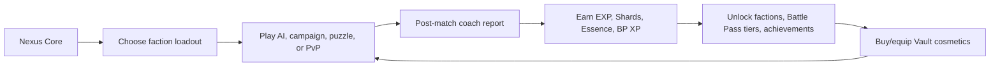
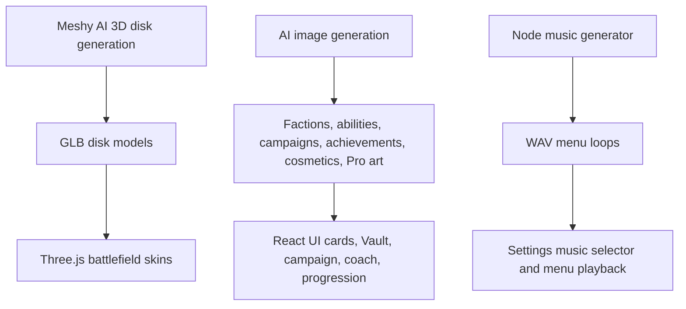
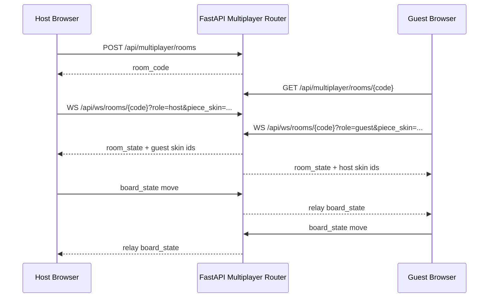
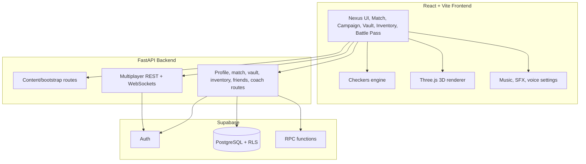
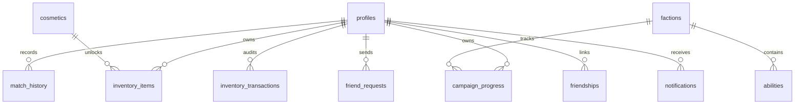

# Aether-Tactics: Dama Sprint

Aether-Tactics is a full-stack checkers tactics game built for the nFactorial Checkers task. It starts from classic draughts, then layers in faction powers, AI coaching, 2D/3D cosmetics, multiplayer rooms, progression, a Vault economy, music, achievements, and a Founder Battle Pass.

The important idea: this is not only a playable board. It is a product prototype around checkers, with the systems a real live game needs: identity, rewards, retention, social play, content, and admin/demo visibility.

## Judge Summary

- **Playable game:** classic checkers, forced captures, multi-capture continuation, flying kings, AI opponents, campaign puzzles, and power-checkers faction abilities.
- **3D battlefield:** Three.js renderer, GLB disk models, dynamic lighting, shadows, camera perspective, generated board materials, and Meshy-generated disk skins.
- **2D battlefield:** responsive board layout with premium SVG disk skins for lower-end devices and mobile-friendly play.
- **Cosmetics:** 3D piece skins, 2D piece skins, board skins, champion badges, emotes, stickers, inventory equip state, and Vault purchases.
- **Multiplayer:** private rooms, join codes/links, fast/ranked queue MVP, WebSocket board sync, host/guest roles, out-of-turn rejection, latest-state replay, forfeits, and visible player piece skins.
- **Progression:** EXP, levels, unlock milestones, achievements, claimable rewards, Shards, Essence, daily missions, streaks, and Battle Pass tiers.
- **AI content:** AI-generated faction art, ability icons, campaign sector art, AI portraits, achievement badges, cosmetics, Pro banners, 3D model skins, and generated menu music.
- **Backend:** FastAPI API, Supabase Auth integration, protected profile/match/inventory/campaign writes, live leaderboard RPCs, and multiplayer WebSockets.
- **Database:** Supabase PostgreSQL schema with RLS, profile progression, match history, inventory transactions, campaign progress, friendships, notifications, Vault catalog, quests, and RPC functions.

## Product Hook

**Asymmetrical checkers with faction powers, AI coaching, and collectible board identity.**

The player loop is:



The design goal is to make checkers feel like a modern tactics service: learn a faction, win a match, get coached, unlock something, personalize your board, and take that identity into multiplayer.

## Core Gameplay

### Checkers Engine

The reusable engine lives in `frontend/src/game/checkers.js` and supports:

- 8x8 board generation and coordinate-based campaign boards.
- Mandatory captures and multi-capture continuation.
- Flying king movement and long-range king captures.
- Legal move generation for normal pieces, kings, captures, quiet moves, and power moves.
- Winner detection from material or no legal moves.
- Three AI styles: random Beginner, heuristic Smart, and minimax Coach.
- AI personality scoring for Nomads, Iron Guard, Sun Court, and Void Order.

### Faction Powers

Each faction has two passives and two ultimates. The powers are both content and gameplay logic, not just text.

| Faction | Unlock | Playstyle | Implemented Abilities |
| --- | --- | --- | --- |
| Steppe Nomads | Free | tempo, escape lanes, sudden mobility | Open Roads, Dust Veil, Dash, Sandstorm Corridor |
| Iron Guard | Level 2 | center control, defense, counterplay | Shield Wall, Vengeance Ledger, Fortify, Barricade |
| Sun Court | Level 4 | promotion races and king pressure | Royal Pressure, Crown Tax, Crown Surge, Sun Lance |
| Void Order | Vault Pass | disruption, teleporting, lane denial | Pressure Field, Echo Mark, Phase Shift, Collapse |

The backend and Supabase seed data store the same faction/ability catalog so the product can move from demo content to live content.

## 2D And 3D Battlefield

The game has two board renderers because different players and devices need different experiences.

### 3D Renderer

The 3D match view uses Three.js and `GLTFLoader`:

- Meshy-generated GLB disk models in `frontend/public/assets/models/`.
- Default Azure and Amber disk models.
- Premium 3D skins: Cosmos Relic, Cryo Prism, and Molten Core.
- Dynamic camera perspective for host/guest sides.
- Procedural canvas textures converted into Three.js maps.
- `MeshPhysicalMaterial` surfaces with roughness, metalness, bump, and emissive maps.
- Multiple board material themes: Nexus Neon, Classic Mahogany, Obsidian & Gold, Void Grid, and Celestial Marble.
- Highlights for selected pieces, legal moves, captures, power targets, protected pieces, blocked squares, and tutorial targets.

3D asset examples:

```text
frontend/public/assets/models/azure.glb
frontend/public/assets/models/amber.glb
frontend/public/assets/models/molten.glb
frontend/public/assets/models/ice.glb
frontend/public/assets/models/cosmos.glb
frontend/public/assets/models/azure_normal_disk.glb
frontend/public/assets/models/skirmish_tactical_board_clean.glb
```

### 2D Renderer

The 2D board keeps the game readable and fast:

- Responsive board/grid layout.
- SVG premium piece skins.
- Basic disk recoloring.
- Same game state, same legal move hints, same faction powers.
- Better fallback for mobile or devices where 3D rendering is heavy.

2D skins are implemented in `frontend/src/premiumPieceSkins.jsx`:

| Skin | Renderer | Notes |
| --- | --- | --- |
| Elemental Rift | 2D | Inferno and Glacier variants |
| Cyber Grid | 2D | Cyan and Magenta scanline style |
| Zen Garden | 2D | Quartz and Basalt variants |
| Cosmos Relic | 3D | Meshy/GLB premium model path |
| Cryo Prism | 3D | Meshy/GLB premium model path |
| Molten Core | 3D | Meshy/GLB premium model path |

### Cosmetic Visibility In Multiplayer

The inventory makes an intentional product distinction:

- **Piece skins are visible to opponents** in multiplayer. The selected piece skin is sent through the room state/WebSocket connection as player skin IDs.
- **Board skins are private** in multiplayer. Your local board can look different without forcing the opponent's board.
- **Renderer compatibility matters:** 3D GLB skins appear in 3D mode; premium SVG skins appear in 2D mode.

That means a judge should test multiplayer with two browser tabs and different equipped piece skins.

## AI-Generated Assets

The game includes generated visual and audio content across the product. These assets are not placeholders; they are wired into screens and reward systems.



Generated art packs are used in:

- `frontend/src/assets/factions/`
- `frontend/src/assets/abilities/`
- `frontend/src/assets/campaign/`
- `frontend/src/assets/ai/`
- `frontend/src/assets/achievements/`
- `frontend/src/assets/cosmetics/`
- `frontend/src/assets/pro/`

Generated music is stored in:

```text
frontend/public/assets/audio/menu_echoes_of_void.wav
frontend/public/assets/audio/menu_steppe_afterglow.wav
frontend/public/assets/audio/menu_celestial_drift.wav
```

The generator script is `tools/generate_menu_music.mjs`.

## Multiplayer

Multiplayer is implemented as an operations MVP:

- Private room creation.
- Join-by-code and shareable room links.
- Fast queue and ranked queue endpoints.
- WebSocket room channel: `/api/ws/rooms/{room_code}`.
- WebSocket challenge channel: `/api/ws/challenges`.
- Host plays white, guest plays black.
- Latest board state replay when a client reconnects.
- Server-side out-of-turn rejection.
- Server-side transition validation for standard moves and several ability moves.
- Forfeit/disconnect handling.
- Friend search, friend requests, friend invites, public profile modals, and city leaderboard panels.



## Campaign, Coach, And Retry Moments

The campaign teaches faction mechanics through scripted tactical moments and then opens into live play.

Implemented campaign examples:

- Open Road Escape: teaches Nomads backward mobility.
- Dash Raid: teaches a Dash into capture-chain setup.
- Dust Veil Bait: teaches defensive bait and counter-capture.
- Sandstorm Gate: teaches temporary blocked lanes.
- Iron First Wall: introduces Shield Wall.
- Solar Crown Engine: introduces Crown Surge promotion.
- Void First Shift: introduces Phase Shift geometry.

After matches, the player gets:

- Combat stats.
- Economy rewards.
- Best move summary.
- Coach focus.
- Ability impact explanation.
- Replay timeline.
- Retry Moment trainer.
- Campaign stars and next sector prompt.
- Next-action buttons such as Next Level, Open Vault, Try Power Skirmish, or Rematch.

The backend coach route is `POST /api/coach/analyze`, with local fallback logic in the frontend if the API is offline.

## Progression, Vault, And Battle Pass

### Progression

The profile system tracks:

- Level and current EXP.
- Shards and Essence.
- PvE and PvP stat blocks.
- Faction unlocks.
- Ability unlocks.
- Owned cosmetics.
- Equipped piece skin, board skin, and badge.
- Achievements claimed.
- Daily puzzle/win/login streaks.
- Audio, voice, motion, theme, and board preferences.

### Vault

The Vault is the shard shop for cosmetics and premium previews:

- 3D piece skins.
- 2D piece skins.
- Board skins.
- Emotes and stickers.
- Void Order Campaign Pass.
- Featured premium rotation.
- Purchase audit trail through `inventory_transactions`.

### Battle Pass

The Founder Season Battle Pass is implemented in local app state and connected to match events:

- Daily missions.
- Weekly missions.
- Free and Pro reward lanes.
- 10 reward tiers.
- BP XP from wins, captures, power matches, campaign clears, faction goals, and PvP wins.
- Auto-claim reward logic for unlocked tiers.
- Pro-gated reward previews and Pro interest capture.

Example reward tiers include Shard caches, Essence, Zen Garden 2D pieces, Cyber Grid 2D pieces, Cryo Prism 3D, Elemental Rift 2D, and Cosmos Relic 3D.

## Architecture



Active app folders:

```text
frontend/   React + Vite app, assets, checkers engine, audio service
backend/    FastAPI app, Supabase integration, coach, multiplayer
supabase/   SQL schema, seed data, RLS policies, RPCs
tools/      asset cleanup and generated music scripts
```

The old root `index.html`, `styles.css`, and `app.js` are kept as static prototype/reference files. The active product is `frontend/` plus `backend/`.

## Supabase Database

Run these files in the Supabase SQL Editor:

```text
supabase/schema.sql
supabase/seed.sql
```

The schema creates:

| Area | Tables / Functions |
| --- | --- |
| Identity | `profiles`, Supabase Auth trigger, public profile helpers |
| Gameplay history | `match_history`, `record_match_and_update_profile(...)` |
| Campaign | `campaign_progress` |
| Economy | `cosmetics`, `inventory_items`, `inventory_transactions`, `unlock_profile_item(...)` |
| Retention | `quest_catalog`, profile streak/settings JSON |
| Social | `friend_requests`, `friendships`, `notifications` |
| Competitive | `get_city_leaderboard(...)`, champion badge distribution route |
| Monetization preview | `pro_interest`, Pro/Vault content flags |

RLS is enabled on all core tables, and protected backend writes derive ownership from the Supabase access token where possible.



## Run Locally

### Environment

Copy the example env files and fill in Supabase values:

```text
.env.example
backend/.env.example
frontend/.env.example
```

Important variables:

```text
SUPABASE_URL=https://your-project.supabase.co
SUPABASE_SERVICE_ROLE_KEY=your-service-role-key
SUPABASE_ANON_KEY=your-anon-key
VITE_SUPABASE_URL=https://your-project.supabase.co
VITE_SUPABASE_ANON_KEY=your-anon-key
VITE_API_URL=http://localhost:8000
VITE_SHOW_ADMIN_DEMO=true
```

Keep `SUPABASE_SERVICE_ROLE_KEY` backend-only.

### Backend

Use Python 3.12.

```bash
cd backend
py -3.12 -m venv .venv
.venv\Scripts\activate
python -m pip install --upgrade pip
python -m pip install -r requirements.txt
python -m uvicorn app.main:app --reload --port 8000
```

API docs:

```text
http://localhost:8000/docs
```

### Frontend

```bash
cd frontend
npm install
npm run dev
```

Open:

```text
http://localhost:5173
```

If the backend is offline, the frontend falls back to local demo content so the UI can still be explored.

## Admin Demo Access

When `VITE_SHOW_ADMIN_DEMO=true`, the gateway shows **Admin Demo Access**.

Admin demo grants:

- Username: `ADMIN_CORE`
- Level: `30`
- Shards/Essence: `999999`
- All factions.
- All abilities.
- All achievements.
- Completed daily quests.
- Every Vault cosmetic.
- Pro active.

Use this for judging and QA. For production, set `VITE_SHOW_ADMIN_DEMO=false`.

## Suggested Judge Demo

1. Open the app and use **Admin Demo Access**.
2. Start the guided demo or open Campaign.
3. Play a Nomads campaign node and show a highlighted ability moment.
4. Finish the match and show the post-match coach report, replay, reward payout, and Retry Moment.
5. Open Inventory and toggle between **3D** and **2D** renderers.
6. Equip a 3D disk skin, then play a match to show it on the 3D board.
7. Equip a 2D disk skin, switch to 2D, and show the different layout.
8. Open Vault and Battle Pass to show the reward economy.
9. Open Multiplayer in two browser tabs, create/join a private room, and show that each player's piece skin is visible online.
10. Open FastAPI `/docs` and Supabase tables/RPCs to prove backend/database work beyond the visible app.

## Screenshots To Take Before Submission

### In-App Screenshots

| Priority | Screenshot | Why It Matters |
| --- | --- | --- |
| 1 | Nexus Core / main hub | Shows the product wrapper, currencies, profile state, and navigation. |
| 1 | 3D match with Molten/Cryo/Cosmos disk skin | Proves Three.js, GLB loading, lighting, and 3D cosmetics. |
| 1 | 2D match with Elemental/Cyber/Zen disk skin | Proves the separate 2D renderer and 2D-only skins. |
| 1 | Inventory Customizer with 2D/3D toggle | Shows renderer compatibility, equip state, preview board, and piece visibility rules. |
| 1 | Two-tab multiplayer match | Shows room sync and opponent-visible piece skins. |
| 1 | Battle Pass screen | Shows missions, free/pro track, BP XP, and premium reward tiers. |
| 1 | Vault screen | Shows shard economy, premium skins, Void Order pass, and purchase flow. |
| 1 | Post-match report | Shows coach review, rewards, replay, best move, ability impact, and Retry Moment. |
| 2 | Campaign map / faction selector | Shows faction-first onboarding and locked/unlocked campaigns. |
| 2 | Ability tutorial moment | Shows highlighted source, target, capture, protected, or blocked squares. |
| 2 | Multiplayer operations lobby | Shows fast/ranked queue, private sessions, friend search, and city leaderboard. |
| 2 | Settings audio tab | Shows generated music tracks, voice, SFX, reduced motion, and theme preferences. |

### Evidence Screenshots Judges Cannot See By Only Launching The App

| Screenshot | What To Capture |
| --- | --- |
| Meshy AI generation screen | Use the attached Meshy screenshot or another one showing the generated disk model, texture variants, prompt, and model stats. |
| Supabase SQL Editor | Show `schema.sql` and `seed.sql` successfully run. Do not show private keys. |
| Supabase Table Editor: `profiles` | Show level, currencies, unlock arrays, equipped skins, settings, PvE/PvP JSON. |
| Supabase Table Editor: `match_history` | Show replay JSON, coach summary, equipped/opponent skins, rewards, mode/result. |
| Supabase Table Editor: `inventory_items` and `inventory_transactions` | Proves Vault purchases/equips and economy audit trail. |
| Supabase Table Editor: `campaign_progress` | Proves campaign progress persists by user/faction. |
| Supabase Auth users | Proves real auth foundation. Hide emails if needed. |
| Supabase RLS policies / database functions | Show RLS is enabled and RPCs like `get_city_leaderboard` and `record_match_and_update_profile`. |
| FastAPI `/docs` | Shows all REST endpoints and WebSocket-related backend surface. |
| Browser network tab during PvP | Show `/api/ws/rooms/{room_code}` WebSocket frames and board state sync. |
| Repository asset folders | Show `assets/models`, `assets/audio`, and generated art folders to prove the media pipeline. |

Best extra evidence: record a short video where you equip a skin, enter multiplayer in another tab, and the opponent sees that disk skin.

## API Routes

Core and content:

- `GET /api/health`
- `GET /api/bootstrap`
- `GET /api/factions`
- `GET /api/campaigns/nomads`
- `GET /api/campaigns/{campaign_id}`
- `GET /api/leaderboard?city=Almaty`
- `POST /api/leaderboard`
- `GET /api/database/health`

Profiles, social, and coach:

- `GET /api/profiles/{user_id}`
- `POST /api/profiles`
- `PATCH /api/profiles/{user_id}`
- `POST /api/profiles/{user_id}/avatar`
- `GET /api/players/search?username=<name>`
- `GET /api/players/{user_id}/public`
- `GET /api/friends?user_id=<uuid>`
- `POST /api/friends/requests`
- `POST /api/friends/requests/{request_id}/accept`
- `POST /api/friends/requests/{request_id}/decline`
- `POST /api/friends/{friend_id}/invite`
- `POST /api/coach/analyze`
- `POST /api/pro/interest`

Progression and economy:

- `POST /api/matches`
- `GET /api/matches/{user_id}`
- `GET /api/campaign-progress/{user_id}/{faction_id}`
- `PUT /api/campaign-progress/{user_id}/{faction_id}`
- `GET /api/vault/items?user_id=<uuid>`
- `POST /api/vault/purchase`
- `GET /api/inventory/{user_id}`
- `POST /api/inventory/equip`
- `POST /api/inventory/grant`
- `GET /api/leaderboard/live?city=Almaty`
- `POST /api/leaderboard/distribute-badges`

Multiplayer:

- `POST /api/multiplayer/rooms`
- `GET /api/multiplayer/rooms/{room_code}`
- `POST /api/multiplayer/queue/{fast|ranked}`
- `GET /api/multiplayer/queue/status`
- `DELETE /api/multiplayer/queue?user_id=<uuid>`
- `WS /api/ws/rooms/{room_code}?user_id=<uuid>&role=host|guest&token=<supabase_access_token>`
- `WS /api/ws/challenges?user_id=<uuid>&token=<supabase_access_token>`

## Deployment Links

- Frontend: _add Vercel/Netlify URL here_
- Backend API: _add Render/Railway/Fly.io URL here_
- GitHub Repository: _add repository URL here_

## Submission Checklist

- Run `supabase/schema.sql` and `supabase/seed.sql`.
- Add production env vars for frontend and backend.
- Deploy frontend and backend.
- Update the links above.
- Set `VITE_SHOW_ADMIN_DEMO=true` for the judge build or provide a seeded judge account.
- Verify signup/login, AI match rewards, campaign progress, Vault purchase/equip, Battle Pass progress, Daily Tactic, leaderboard filters, and a two-tab private multiplayer room.
- Add the screenshots listed above, especially Meshy AI, Supabase tables/RPCs/RLS, FastAPI docs, 3D/2D skins, and multiplayer skin visibility.

## Future Production Hardening

- Replace in-memory multiplayer rooms with Redis or Supabase Realtime.
- Split the large `frontend/src/App.jsx` into feature modules.
- Add automated browser tests for 3D rendering, room sync, inventory equip, and reward progression.
- Add CDN/storage workflow for generated media assets.
- Add admin-only Supabase tooling for seasonal content updates and leaderboard badge distribution.
