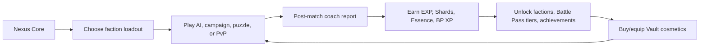
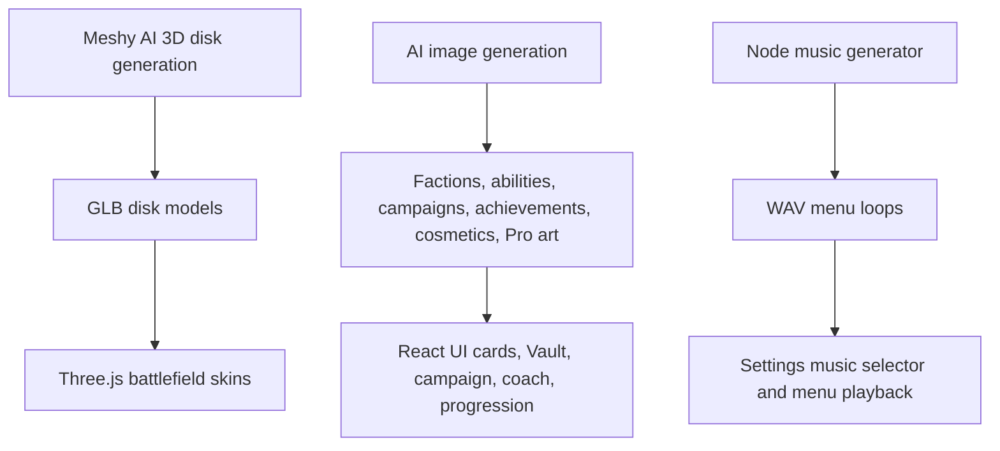
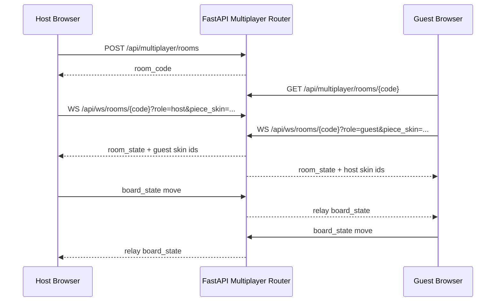
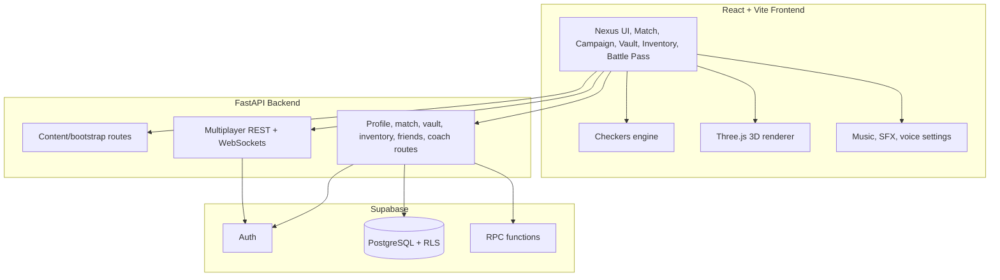
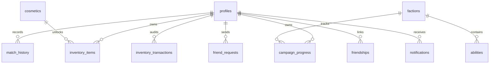

# Aether Tactics

Aether Tactics is a full-stack checkers tactics game built as a polished nFactorial Checkers entry. It starts from classic draughts, then layers in faction powers, AI coaching, 2D/3D cosmetics, multiplayer rooms, progression, a Vault economy, music, achievements, and a Founder Battle Pass.

The project is not only a playable board. It is a product prototype around checkers, with the systems a real live game needs: identity, rewards, retention, social play, content, and operational tooling.

## Live Deployment

- Frontend: https://aether-tactics-frontend.vercel.app/menu
- Backend API: https://aether-tactics-backend.onrender.com
- API docs: https://aether-tactics-backend.onrender.com/docs
- Health check: https://aether-tactics-backend.onrender.com/api/health
- Database health: https://aether-tactics-backend.onrender.com/api/database/health
- Repository: https://github.com/InfectedDuck/Aether-Tactics

## Why It Stands Out

Aether Tactics treats checkers as a complete tactics platform instead of a one-screen board game. The core rules are still real checkers, but the surrounding product adds the things that make a modern game feel alive: faction identity, guided lessons, progression, multiplayer, cosmetics, social play, a seasonal pass, and a backend that persists meaningful player state.

- **Rules with depth:** forced captures, multi-jumps, flying kings, AI search, faction abilities, and server-side move validation.
- **A complete player journey:** onboarding, campaign lessons, Daily Tactic, post-match coach reports, Retry Moments, rewards, Vault purchases, and Battle Pass progress.
- **Real identity and persistence:** Supabase Auth, profiles, match history, campaign progress, inventory, friends, notifications, and city leaderboards.
- **A premium-feeling board:** Three.js 3D pieces and board materials, a fast 2D renderer, generated music, generated art, and collectible skins.
- **Multiplayer beyond a mockup:** private lobbies, fast/ranked queues, WebSocket sync, host/guest roles, friend invites, reconnect state, and forfeit/disconnect handling.

## Try These First

1. Open the live frontend and enter **Nexus Core**.
2. Play a **Campaign** lesson such as Nomads' Open Road Escape to see guided faction mechanics.
3. Finish a match and read the **coach report** plus the interactive **Retry Moment**.
4. Open **Inventory** and switch between 3D and 2D skins to see renderer-specific cosmetics.
5. Open **Vault** and **Battle Pass** to see the economy, missions, and reward loop.
6. For multiplayer, use two real Supabase accounts in two browser sessions, then try **Fast Match** or **Host Lobby**.
7. Open the backend `/docs` page to inspect the FastAPI surface behind the game.

## Highlights

- **Playable game:** classic checkers, forced captures, multi-capture continuation, flying kings, AI opponents, campaign puzzles, and power-checkers faction abilities.
- **3D battlefield:** Three.js renderer, GLB disk models, dynamic lighting, shadows, camera perspective, generated board materials, and Meshy-generated disk skins.
- **2D battlefield:** responsive board layout with premium SVG disk skins for lower-end devices and mobile-friendly play.
- **Cosmetics:** 3D piece skins, 2D piece skins, board skins, champion badges, emotes, stickers, inventory equip state, and Vault purchases.
- **Multiplayer:** private rooms, join codes/links, fast/ranked queue MVP, WebSocket board sync, host/guest roles, out-of-turn rejection, latest-state replay, forfeits, and visible player piece skins.
- **Progression:** EXP, levels, unlock milestones, achievements, claimable rewards, Shards, Essence, daily missions, streaks, and Battle Pass tiers.
- **AI content:** AI-generated faction art, ability icons, campaign sector art, AI portraits, achievement badges, cosmetics, Pro banners, 3D model skins, and generated menu music.
- **Backend:** FastAPI API, Supabase Auth integration, protected profile/match/inventory/campaign writes, live leaderboard RPCs, and multiplayer WebSockets.
- **Database:** Supabase PostgreSQL schema with RLS, profile progression, match history, inventory transactions, campaign progress, friendships, notifications, Vault catalog, quests, and RPC functions.

## Product Hook

**Asymmetrical checkers with faction powers, AI coaching, and collectible board identity.**

The player loop is:



The design goal is to make checkers feel like a modern tactics service: learn a faction, win a match, get coached, unlock something, personalize your board, and take that identity into multiplayer.

## Game Modes

| Mode | What It Shows |
| --- | --- |
| AI Skirmish | Classic or Power checkers against Beginner, Smart, or Coach AI profiles. |
| Campaign Trails | Scripted faction lessons that become live boards after the guided tactical moment. |
| Daily Tactic | Puzzle-style daily challenge with streak and quest progress. |
| Multiplayer | Fast queue, ranked queue, private host lobbies, join codes, friend invites, and WebSocket board sync. |
| Vault / Inventory | Shard economy, collectible cosmetics, 2D/3D renderer compatibility, and equipped identity. |
| Battle Pass | Daily/weekly missions, BP XP, free/pro lanes, and auto-claim reward tiers. |

## Core Gameplay

### Checkers Engine

The reusable engine lives in `frontend/src/game/checkers.js` and supports:

- 8x8 board generation and coordinate-based campaign boards.
- Mandatory captures and multi-capture continuation.
- Flying king movement and long-range king captures.
- Legal move generation for normal pieces, kings, captures, quiet moves, and power moves.
- Winner detection from material or no legal moves.
- Three AI styles: random Beginner, heuristic Smart, and minimax Coach.
- AI personality scoring for Nomads, Iron Guard, Sun Court, and Void Order.

### Faction Powers

Each faction has two passives and two ultimates. The powers are both content and gameplay logic, not just text.

| Faction | Unlock | Playstyle | Implemented Abilities |
| --- | --- | --- | --- |
| Steppe Nomads | Free | tempo, escape lanes, sudden mobility | Open Roads, Dust Veil, Dash, Sandstorm Corridor |
| Iron Guard | Level 2 | center control, defense, counterplay | Shield Wall, Vengeance Ledger, Fortify, Barricade |
| Sun Court | Level 4 | promotion races and king pressure | Royal Pressure, Crown Tax, Crown Surge, Sun Lance |
| Void Order | Vault Pass | disruption, teleporting, lane denial | Pressure Field, Echo Mark, Phase Shift, Collapse |

The backend and Supabase seed data store the same faction/ability catalog so the product can move from demo content to live content.

## 2D And 3D Battlefield

The game has two board renderers because different players and devices need different experiences.

### 3D Renderer

The 3D match view uses Three.js and `GLTFLoader`:

- Meshy-generated GLB disk models in `frontend/public/assets/models/`.
- Default Azure and Amber disk models.
- Premium 3D skins: Cosmos Relic, Cryo Prism, and Molten Core.
- Dynamic camera perspective for host/guest sides.
- Procedural canvas textures converted into Three.js maps.
- `MeshPhysicalMaterial` surfaces with roughness, metalness, bump, and emissive maps.
- Multiple board material themes: Nexus Neon, Classic Mahogany, Obsidian & Gold, Void Grid, and Celestial Marble.
- Highlights for selected pieces, legal moves, captures, power targets, protected pieces, blocked squares, and tutorial targets.

3D asset examples:

```text
frontend/public/assets/models/azure.glb
frontend/public/assets/models/amber.glb
frontend/public/assets/models/molten.glb
frontend/public/assets/models/ice.glb
frontend/public/assets/models/cosmos.glb
frontend/public/assets/models/azure_normal_disk.glb
frontend/public/assets/models/skirmish_tactical_board_clean.glb
```

### 2D Renderer

The 2D board keeps the game readable and fast:

- Responsive board/grid layout.
- SVG premium piece skins.
- Basic disk recoloring.
- Same game state, same legal move hints, same faction powers.
- Better fallback for mobile or devices where 3D rendering is heavy.

2D skins are implemented in `frontend/src/premiumPieceSkins.jsx`:

| Skin | Renderer | Notes |
| --- | --- | --- |
| Elemental Rift | 2D | Inferno and Glacier variants |
| Cyber Grid | 2D | Cyan and Magenta scanline style |
| Zen Garden | 2D | Quartz and Basalt variants |
| Cosmos Relic | 3D | Meshy/GLB premium model path |
| Cryo Prism | 3D | Meshy/GLB premium model path |
| Molten Core | 3D | Meshy/GLB premium model path |

### Cosmetic Visibility In Multiplayer

The inventory makes an intentional product distinction:

- **Piece skins are visible to opponents** in multiplayer. The selected piece skin is sent through the room state/WebSocket connection as player skin IDs.
- **Board skins are private** in multiplayer. Your local board can look different without forcing the opponent's board.
- **Renderer compatibility matters:** 3D GLB skins appear in 3D mode; premium SVG skins appear in 2D mode.

For multiplayer testing, use two browser tabs or two browsers with different signed-in accounts and different equipped piece skins.

## AI-Generated Assets

The game includes generated visual and audio content across the product. These assets are not placeholders; they are wired into screens and reward systems.



Generated art packs are used in:

- `frontend/src/assets/factions/`
- `frontend/src/assets/abilities/`
- `frontend/src/assets/campaign/`
- `frontend/src/assets/ai/`
- `frontend/src/assets/achievements/`
- `frontend/src/assets/cosmetics/`
- `frontend/src/assets/pro/`

Generated music is stored in:

```text
frontend/public/assets/audio/menu_echoes_of_void.wav
frontend/public/assets/audio/menu_steppe_afterglow.wav
frontend/public/assets/audio/menu_celestial_drift.wav
```

The generator script is `tools/generate_menu_music.mjs`.

## Multiplayer

Multiplayer is implemented as an operations MVP:

- Private room creation.
- Join-by-code and shareable room links.
- Fast queue and ranked queue endpoints.
- WebSocket room channel: `/api/ws/rooms/{room_code}`.
- WebSocket challenge channel: `/api/ws/challenges`.
- Host plays white, guest plays black.
- Latest board state replay when a client reconnects.
- Server-side out-of-turn rejection.
- Server-side transition validation for standard moves and several ability moves.
- Forfeit/disconnect handling.
- Friend search, friend requests, friend invites, public profile modals, and city leaderboard panels.

### Multiplayer Troubleshooting

If multiplayer does not start in the deployed build, create and sign in with real Supabase accounts instead of using guest mode or admin demo access. Use two separate real accounts in two browsers or an incognito window, then try **Fast Match** from both accounts or create a **Host Lobby** with one account and join it from the other. The multiplayer API and WebSocket flow are designed around authenticated commander sessions, so real accounts are the most reliable way to test matchmaking and private lobbies.



## Campaign, Coach, And Retry Moments

The campaign teaches faction mechanics through scripted tactical moments and then opens into live play.

Implemented campaign examples:

- Open Road Escape: teaches Nomads backward mobility.
- Dash Raid: teaches a Dash into capture-chain setup.
- Dust Veil Bait: teaches defensive bait and counter-capture.
- Sandstorm Gate: teaches temporary blocked lanes.
- Iron First Wall: introduces Shield Wall.
- Solar Crown Engine: introduces Crown Surge promotion.
- Void First Shift: introduces Phase Shift geometry.

After matches, the player gets:

- Combat stats.
- Economy rewards.
- Best move summary.
- Coach focus.
- Ability impact explanation.
- Replay timeline.
- Retry Moment trainer.
- Campaign stars and next sector prompt.
- Next-action buttons such as Next Level, Open Vault, Try Power Skirmish, or Rematch.

The backend coach route is `POST /api/coach/analyze`, with local fallback logic in the frontend if the API is offline.

## Progression, Vault, And Battle Pass

### Progression

The profile system tracks:

- Level and current EXP.
- Shards and Essence.
- PvE and PvP stat blocks.
- Faction unlocks.
- Ability unlocks.
- Owned cosmetics.
- Equipped piece skin, board skin, and badge.
- Achievements claimed.
- Daily puzzle/win/login streaks.
- Audio, voice, motion, theme, and board preferences.

### Vault

The Vault is the shard shop for cosmetics and premium previews:

- 3D piece skins.
- 2D piece skins.
- Board skins.
- Emotes and stickers.
- Void Order Campaign Pass.
- Featured premium rotation.
- Purchase audit trail through `inventory_transactions`.

### Battle Pass

The Founder Season Battle Pass is implemented in local app state and connected to match events:

- Daily missions.
- Weekly missions.
- Free and Pro reward lanes.
- 10 reward tiers.
- BP XP from wins, captures, power matches, campaign clears, faction goals, and PvP wins.
- Auto-claim reward logic for unlocked tiers.
- Pro-gated reward previews and Pro interest capture.

Example reward tiers include Shard caches, Essence, Zen Garden 2D pieces, Cyber Grid 2D pieces, Cryo Prism 3D, Elemental Rift 2D, and Cosmos Relic 3D.

## Social, Profile, And Polish

Aether Tactics includes the small product details that make the prototype feel less like a class exercise and more like a shippable game slice:

- Public commander profiles with city, level, bio, avatar/profile image, badge, and PvP stats.
- Player search, friend requests, accepted friendships, and friend lobby invites.
- Notifications for social events and leaderboard badge awards.
- City leaderboard filters and champion badges for top-ranked players.
- Settings for generated music tracks, master/music/SFX/voice volume, reduced motion, board preferences, and light/dark theme.
- Shareable match recap text built from the post-match report.
- Pro interest capture and premium reward previews without requiring real payments.

## Architecture



Active app folders:

```text
frontend/   React + Vite app, assets, checkers engine, audio service
backend/    FastAPI app, Supabase integration, coach, multiplayer
supabase/   SQL schema, seed data, RLS policies, RPCs
tools/      asset cleanup and generated music scripts
```

The old root `index.html`, `styles.css`, and `app.js` are kept as static prototype/reference files. The active product is `frontend/` plus `backend/`.

## Engineering Notes

- The frontend is a Vite React app with a reusable checkers engine, API client, Supabase Auth client, audio service, and separate 2D/3D render paths.
- The backend is a FastAPI app with typed request schemas, Supabase service integration, REST routes, and WebSocket multiplayer channels.
- Protected profile, match, inventory, campaign, friend, and vault writes resolve ownership from the Supabase access token when available.
- Multiplayer validates turns and several board transitions on the server, including standard moves plus ability moves such as Dash, Phase Shift, Open Roads, Sun Lance, Crown Surge, Fortify, Barricade, Sandstorm, and Collapse.
- The app has graceful local fallback data for content/bootstrap flows, so the frontend can still be explored if the backend is temporarily unavailable.
- `SUPABASE_SERVICE_ROLE_KEY` is used only by the backend. The frontend uses the public anon key and sends user sessions through Supabase Auth.

## Supabase Database

Run these files in the Supabase SQL Editor:

```text
supabase/schema.sql
supabase/seed.sql
```

The schema creates:

| Area | Tables / Functions |
| --- | --- |
| Identity | `profiles`, Supabase Auth trigger, public profile helpers |
| Gameplay history | `match_history`, `record_match_and_update_profile(...)` |
| Campaign | `campaign_progress` |
| Economy | `cosmetics`, `inventory_items`, `inventory_transactions`, `unlock_profile_item(...)` |
| Retention | `quest_catalog`, profile streak/settings JSON |
| Social | `friend_requests`, `friendships`, `notifications` |
| Competitive | `get_city_leaderboard(...)`, champion badge distribution route |
| Monetization preview | `pro_interest`, Pro/Vault content flags |

RLS is enabled on all core tables, and protected backend writes derive ownership from the Supabase access token where possible.



## Run Locally

### Environment

Copy the example env files and fill in Supabase values:

```text
.env.example
backend/.env.example
frontend/.env.example
```

Important variables:

```text
SUPABASE_URL=https://your-project.supabase.co
SUPABASE_SERVICE_ROLE_KEY=your-service-role-key
SUPABASE_ANON_KEY=your-anon-key
FRONTEND_ORIGIN=http://localhost:5173
VITE_SUPABASE_URL=https://your-project.supabase.co
VITE_SUPABASE_ANON_KEY=your-anon-key
VITE_API_URL=http://localhost:8000
VITE_SHOW_ADMIN_DEMO=true
```

Keep `SUPABASE_SERVICE_ROLE_KEY` backend-only.

### Backend

Use Python 3.12.

```bash
cd backend
py -3.12 -m venv .venv
.venv\Scripts\activate
python -m pip install --upgrade pip
python -m pip install -r requirements.txt
python -m uvicorn app.main:app --reload --port 8000
```

API docs:

```text
http://localhost:8000/docs
```

### Frontend

```bash
cd frontend
npm install
npm run dev
```

Open:

```text
http://localhost:5173
```

If the backend is offline, the frontend falls back to local demo content so the UI can still be explored.

## Demo Access

When `VITE_SHOW_ADMIN_DEMO=true`, the gateway shows **Admin Demo Access**.

Demo access grants:

- Username: `ADMIN_CORE`
- Level: `30`
- Shards/Essence: `999999`
- All factions.
- All abilities.
- All achievements.
- Completed daily quests.
- Every Vault cosmetic.
- Pro active.

For a public production build, set `VITE_SHOW_ADMIN_DEMO=false`. Multiplayer should be tested with real Supabase accounts instead of the admin demo session.

## API Routes

Core and content:

- `GET /api/health`
- `GET /api/bootstrap`
- `GET /api/factions`
- `GET /api/campaigns/nomads`
- `GET /api/campaigns/{campaign_id}`
- `GET /api/leaderboard?city=Almaty`
- `POST /api/leaderboard`
- `GET /api/database/health`

Profiles, social, and coach:

- `GET /api/profiles/{user_id}`
- `POST /api/profiles`
- `PATCH /api/profiles/{user_id}`
- `POST /api/profiles/{user_id}/avatar`
- `GET /api/players/search?username=<name>`
- `GET /api/players/{user_id}/public`
- `GET /api/friends?user_id=<uuid>`
- `POST /api/friends/requests`
- `POST /api/friends/requests/{request_id}/accept`
- `POST /api/friends/requests/{request_id}/decline`
- `POST /api/friends/{friend_id}/invite`
- `POST /api/coach/analyze`
- `POST /api/pro/interest`

Progression and economy:

- `POST /api/matches`
- `GET /api/matches/{user_id}`
- `GET /api/campaign-progress/{user_id}/{faction_id}`
- `PUT /api/campaign-progress/{user_id}/{faction_id}`
- `GET /api/vault/items?user_id=<uuid>`
- `POST /api/vault/purchase`
- `GET /api/inventory/{user_id}`
- `POST /api/inventory/equip`
- `POST /api/inventory/grant`
- `GET /api/leaderboard/live?city=Almaty`
- `POST /api/leaderboard/distribute-badges`

Multiplayer:

- `POST /api/multiplayer/rooms`
- `GET /api/multiplayer/rooms/{room_code}`
- `POST /api/multiplayer/queue/{fast|ranked}`
- `GET /api/multiplayer/queue/status`
- `DELETE /api/multiplayer/queue?user_id=<uuid>`
- `WS /api/ws/rooms/{room_code}?user_id=<uuid>&role=host|guest&token=<supabase_access_token>`
- `WS /api/ws/challenges?user_id=<uuid>&token=<supabase_access_token>`

## Deployment Links

- Frontend (Vercel): https://aether-tactics-frontend.vercel.app/menu
- Backend API (Render): https://aether-tactics-backend.onrender.com
- API docs: https://aether-tactics-backend.onrender.com/docs
- Backend health: https://aether-tactics-backend.onrender.com/api/health
- Database health: https://aether-tactics-backend.onrender.com/api/database/health
- GitHub repository: https://github.com/InfectedDuck/Aether-Tactics

## Deployment Settings

### Vercel Frontend

- Root directory: `frontend`
- Build command: `npm run build`
- Output directory: `dist`
- Required environment variables:
  - `VITE_API_URL=https://aether-tactics-backend.onrender.com`
  - `VITE_SUPABASE_URL=https://<your-project>.supabase.co`
  - `VITE_SUPABASE_ANON_KEY=<anon-key>`
  - `VITE_SHOW_ADMIN_DEMO=true`

### Render Backend

Use `render.yaml` or configure manually:

- Root directory: `backend`
- Build command: `pip install -r requirements.txt`
- Start command: `uvicorn app.main:app --host 0.0.0.0 --port $PORT`
- Required environment variables:
  - `PYTHON_VERSION=3.12.8`
  - `SUPABASE_URL=https://<your-project>.supabase.co`
  - `SUPABASE_SERVICE_ROLE_KEY=<service-role-key>`
  - `FRONTEND_ORIGIN=https://aether-tactics-frontend.vercel.app`

Never expose `SUPABASE_SERVICE_ROLE_KEY` in Vercel or frontend code.

### Supabase Auth

- Site URL: `https://aether-tactics-frontend.vercel.app`
- Redirect URLs:
  - `https://aether-tactics-frontend.vercel.app/*`
  - `http://localhost:5173/*`

## Deployment Verification

- Run `supabase/schema.sql` and `supabase/seed.sql`.
- Add production env vars for frontend and backend.
- Verify `GET /api/health`, `GET /api/database/health`, and `/docs` on the deployed backend.
- Verify signup/login, AI match rewards, campaign progress, Vault purchase/equip, Battle Pass progress, Daily Tactic, leaderboard filters, and a two-account multiplayer room.
- For Fast Match or Host Lobby, use real Supabase accounts in two browser sessions. Guest mode and admin demo access are useful for exploring the app, but authenticated accounts are the most reliable path for multiplayer.

## Future Production Hardening

- Replace in-memory multiplayer rooms with Redis or Supabase Realtime.
- Split the large `frontend/src/App.jsx` into feature modules.
- Add automated browser tests for 3D rendering, room sync, inventory equip, and reward progression.
- Add CDN/storage workflow for generated media assets.
- Add admin-only Supabase tooling for seasonal content updates and leaderboard badge distribution.
